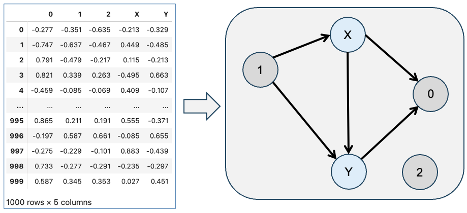

# ADIA Lab Causal Discovery




### Overview

Discovering the causal structure that governs the relationships among variables from their observations is a challenging and valuable problem in many domains of application, like healthcare, economics, social sciences, environmental science, education, etc. In this competition, the basic building block that you are given is a dataset of observations of a set of variables and your task is to discover the causal directed acyclic graph (DAG) that defines the causal relationships between them.

<figure><figcaption><p>From a pandas DataFrame to a causal directed acyclic graph (DAG)</p></figcaption></figure>


### Description

The task of this competition is _causal discovery_: your goal is to find the causal graph (DAG) for each dataset you will be given. To help you in this endeavor, we provide a large number of example datasets together with their corresponding causal DAGs — as the training set — so that you can calibrate your unsupervised discovery methods, or train your prediction models if you prefer a supervised approach. Your causal discovery algorithm has to be designed to take as input a dataset and to output the causal DAG.

All causal graphs in this competition have a specific structure: they have at least two special nodes, X and Y, which are the treatment and the outcome variables, respectively. The treatment variable X is the one that causes effects on the outcome variable Y. All other variables/nodes may or may not influence X and Y, possibly interfering with their relationship X→Y, so each may act as a confounder on X→Y, or as a collider, mediator, or be a cause or consequence of X (or Y), or not have any influence at all, etc.

The goal of the competition is to estimate the causal graph behind each dataset. The scores are based on accurately identifying the role of all nodes on X→Y.

Both unsupervised and supervised approaches are warmly welcome.

### Evaluation

In all datasets, there are two special variables — X and Y — that are the treatment and the effect. We always assume that there is a causal link from X to Y: X→Y. For each predicted graph, the evaluation metric quantifies the correctness of the edges/arrows for all nodes but considers only the edges (or lack of) from each node to X and Y. In other words, the evaluation metric wants to assess the effects of errors in specifying wrong edges affecting X and Y.

Each node K (with the exclusion of X and Y) can be in one of these 8 categories:

1. Confounder: K→X, K→Y, X→Y
2. Collider : X→K, Y→K, X→Y
3. Mediator: X→K, K→Y, X→Y
4. Independent: X→Y (no links to X or Y)
5. Cause of X: K→X→Y
6. Consequence of X: X→K, X→Y
7. Cause of Y: K→Y, X→Y
8. Consequence of Y: X→Y→K

Each node in your predicted graph will be tested against its true class and the final scoring metric across all datasets is the _**multiclass balanced accuracy**_.

Participants should submit predicted DAGs for all datasets, and we will transform the predicted DAGs to the corresponding classes for scoring.

### Prediction File

For each `example_id` in the test set, which is in the form `<dataset_id>_<source_variable>_<target_variable>` you must predict a binary value (0 or 1) representing the absence or presence of a causal link between `<source_variable>` and `<target_variable>`. The file should contain a header and have the following format:

```
example_id, prediction
00000_0_0, 0
00000_0_1, 0
00000_0_X, 1
00000_0_4, 0
etc.
```

For example, the row `01234_X_1, 1` means that for the test dataset `01234`, the participant predicts a causal link between X and 1: X→1.

### Dataset Description

The whole dataset of the competition, between the training set and test set, comprises 47,000 individual datasets, each of 1000 observations for a certain number of variables, which is between 3 and 10. For the training datasets, the corresponding causal graphs are available. The causal graph is provided via its adjacency matrix, so if the dataset has 8 variables, the adjacency matrix is 8x8 matrix — which becomes 9x9 in the corresponding CSV file because the variable names are indicated for each row and column — where a value of 1 at position (i, j), means that variable i causes variable j, and value 0 means it does not.

### Tutorial #1&#x20;



### Prize

| Winners’ rank | Prize value |
| ------------- | ----------- |
| 1st place     | $40,000 USD |
| 2nd place     | $20,000 USD |
| 3rd place     | $10,000 USD |
| 4th place     | $5,000 USD  |
| 5th place     | $5,000 USD  |
| 6th place     | $5,000 USD  |
| 7th place     | $5,000 USD  |
| 8th place     | $3,500 USD  |
| 9th place     | $3,500 USD  |
| 10th place    | $3,000 USD  |
