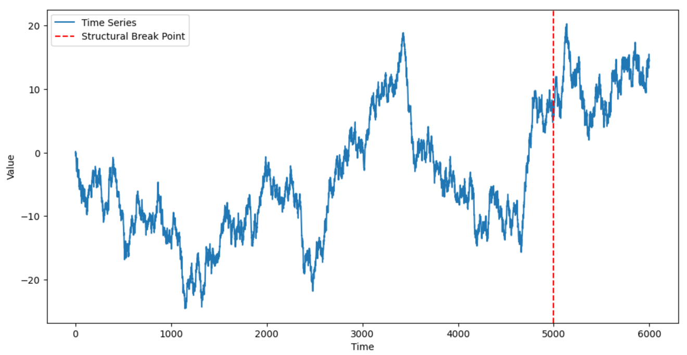

# ADIA Lab Structural Break Challenge

## Overview

Detecting structural changes in time series data is a critical task across various scientific and engineering domains. In this competition, you are given univariate time series data which, at an explicitly given point, may have experienced a structural break, meaning that the process governing the data generation may have changed from that point on. Given the entire time series and the indication of that time point, your task is to determine whether a structural break has occurred or not.

<figure><figcaption><p>Structural Break Example</p></figcaption></figure>

## Description

The task of this competition is structural break detection: your goal is to determine whether a structural break has occurred or not at a specified point in each time series you will be given. To help you in this endeavor, we provide a large number of example time series together with their corresponding labels — as the training set — so that you can calibrate your detection methods, or train your prediction models if you prefer a supervised approach. Your detection algorithm has to be designed to take as input a time series and output the likelihood (a score between `0` and `1`) of a structural break.

This problem holds significant relevance in fields such as:

* Climatology, where identifying shifts in weather patterns can signal climate anomalies or long-term climate change;
* Industrial settings, where detecting structural breaks in machinery sensor data can preemptively indicate equipment failures or maintenance needs;
* Finance, where recognizing structural breaks in market data is crucial for modeling asset prices and managing financial risks;
* Healthcare monitoring systems, where sudden changes in physiological signals may reflect critical health events requiring immediate attention.

The challenge lies in predicting structural breaks by relying on the empirical patterns present in the labeled examples. The availability of a large labeled dataset enables the application of data-driven methodologies, such as machine learning algorithms, to model and anticipate these structural changes effectively.

### Competition Timeline

* Start Date: May 14, 2025 at 2:00 PM CET
* End Date: September 15, 2025 at 4:59 PM CET
* Final Evaluation: November 1, 2025 at 2:00 PM CET
* Winners Announcement: November 14, 2025 at 5:00 PM CET

## Evaluation

For each time series in the test set, your task is to predict a score between `0` and `1`, where values towards `0` mean that no structural break occurred at the specified boundary point, and values towards `1` mean that a structural break did occur. The evaluation metric will be the [ROC AUC (Area Under the Receiver Operating Characteristic Curve)](https://scikit-learn.org/stable/modules/generated/sklearn.metrics.roc_auc_score.html), which measures the performance of detection algorithms regardless of their specific calibration.

A ROC AUC value around `0.5` means that the algorithm is not able to detect structural breaks better than random chance, while values approaching `1.0` indicate perfect detection. The ROC AUC allows us to compare the output of different detection methods by removing the specific bias of each method towards false positives or false negatives.

The competition follows a two-stage evaluation process:

1. **Public Leaderboard**: Each submission is immediately scored against a portion of the test data, and results appear on the public leaderboard;
2. **Private Leaderboard**: At the end of the competition, selected submissions are evaluated on the remaining test data to determine the final rankings.

This approach ensures that models are evaluated on their ability to generalize rather than potentially overfitting to the public leaderboard data.

## Code Submission

This is a code competition where participants are required to submit their Python code (files or notebooks) directly to the CrunchDAO platform. Your submission should:

1. Process and analyze the data;
2. Output a score between `0` and `1` for each time series `id` in the test set, representing the likelihood of a structural break;
3. Your code must produce deterministic output, or it will be ineligible for any rewards;
4. Only the team leader will be ranked on the leaderboard, and be eligible for a reward.

Your submitted code will be executed on the competition platform and automatically scored against a portion of the test set. Shortly after submission, your score will appear on the public leaderboard of the competition.

### Submission Requirements

* Your main solution file should follow the template provided by the competition host [here](https://colab.research.google.com/github/crunchdao/quickstarters/blob/master/competitions/structural-break/quickstarters/baseline/baseline.ipynb);
* Your solution must include `train()` and `infer()` functions. The first one is meant to train your model on the training set, in case your model needs that, otherwise it can be left empty. The second one takes the test data as input and returns predictions;
* The execution time of your solution should not exceed the platform's time limits: 15 hours per week.

## Dataset Description

The dataset for this competition comprises tens of thousands of synthetic univariate time series, each containing approximately 5,000 to 10,000 values with a designated boundary point. For each training time series, a label (`True` for break, `False` for no break) indicates whether a structural break occurred at this boundary point.

The time series in this competition are designed to represent various real-world scenarios where structural breaks may occur, with different levels of difficulty in detection. This includes scenarios similar to those found in financial markets, climate data, industrial sensor readings, and biomedical signals, among others. The challenge is to develop algorithms that can generalize across these scenarios and accurately detect structural breaks in new, unseen data.

### Data Format

For the training data, the `X` variable will be provided as a `pandas.DataFrame` with a `MultiIndex` structure. Here's an example of the format:

```
                  value  period
id     time
0      0       0.001858      0
       1      -0.001664      0
       2      -0.004386      0
       3       0.000699      0
       4      -0.002433      0
...              ...        ...
10000  1890   -0.005903      1
       1891    0.007295      1
       1892    0.003527      1
       1893    0.007218      1
       1894    0.000034      1
```

The `DataFrame` has the following structure:

* A `MultiIndex` with two levels:
  * `id`: Identifies the unique time series (each time series has a unique ID)
  * `time`: The timestep within each time series
* The columns include:
  * `value`: The actual time series value at that timestep;
  * `period`: A binary indicator where `0` represents the period before the boundary point, and `1` represents the period after the boundary point

The `y` variable is a boolean `pandas.Series`, with `id` as index, indicating whether a structural break
\
occurred at the boundary point for that time series (`True` if there was a break, `False` otherwise).

The test data will follow the same format but will not include the
`breakpoint` column. Your code will need to process these time series and generate predictions of the likelihood of a structural break for each unique time series ID.

## Methodology Suggestions

Methods such as change point detection algorithms, tests for equality of distributions, anomaly detection, or supervised learning models can be utilized to recognize patterns associated with structural breaks. Some approaches to consider include:

* Statistical tests comparing the distributions before and after the boundary point;
* Feature extraction from both parts of the time series for comparative analysis;
* Time series modeling to detect deviations from expected patterns;
* Deep learning approaches for automated pattern recognition.

Careful preprocessing of the time series data is an essential step in developing robust detection models.

The ultimate goal is to develop reliable algorithms for detecting structural breaks in time series data across various domains where such changes have significant implications for decision-making and risk management.

## Prize

| Winners’ rank | Prize value |
| ------------- | ----------- |
| 1st place     | $40,000 USD |
| 2nd place     | $20,000 USD |
| 3rd place     | $10,000 USD |
| 4th place     | $5,000 USD  |
| 5th place     | $5,000 USD  |
| 6th place     | $5,000 USD  |
| 7th place     | $5,000 USD  |
| 8th place     | $3,500 USD  |
| 9th place     | $3,500 USD  |
| 10th place    | $3,000 USD  |

