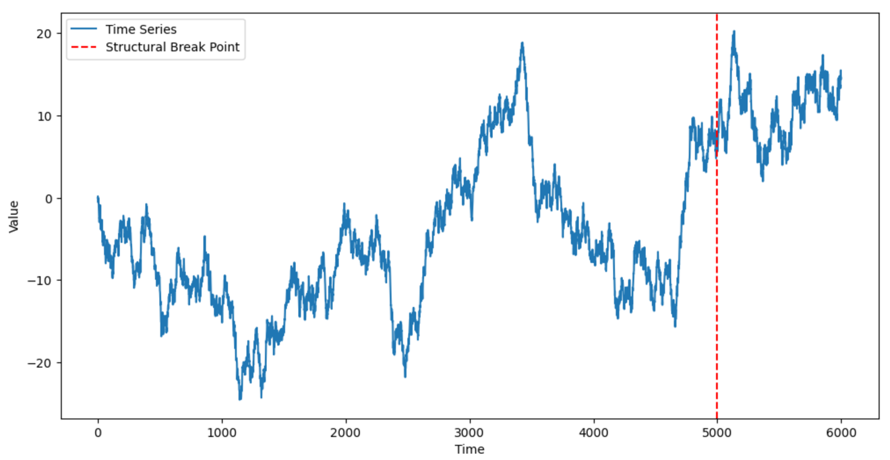

# ADIA Lab Structural Break Challenge

## Overview

Detecting structural changes in time series data is a critical task across various scientific and engineering domains. In this competition, you are given univariate time series data which, at an explicitly given point, may have experienced a structural break, meaning that the process governing the data generation may have changed from that point on. Given the entire time series and the indication of that time point, your task is to determine whether a structural break has occurred or not.

<figure><figcaption><p>Structural Break Example</p></figcaption></figure>

## Problem Statement

The task of this competition is to determine whether a permanent structural break has occurred in a univariate time series at a specified point in time.

Each series is comprised of two consecutive segments separated by an explicitly given boundary point: a pre-boundary segment, representing the reference behaviour, and a post-boundary segment, representing the period under scrutiny. Each series contains roughly 1,000 to 5,000 observations in total, and the boundary position is known to the participant.

Both segments are given in full and simultaneously: there is no streaming and no hidden data. For each series, the code contributed by the participant must output a single score between `0` and `1`, reflecting the confidence that the data-generating process changed at the boundary - `0` if absolutely confident no break occurred, `1` if absolutely confident a break occurred.

The training data combines a large collection (around 10,000 series) of synthetic time series with known break labels, exhibiting a wide variety of break types - including changes in mean, variance, distributional shape, dependence structure, and tail behaviour.

Submissions are evaluated on an independent test set of comparable size using `ROC AUC` computed across all series: a single score per series is compared with the corresponding ground-truth label, and the area under the ROC curve is the final score.

### Competition Timeline

* Start Date: May 14th, 2025 at 10:00 AM CET
* End Date: September 30th, 2025 at 6:00 PM CET
* Final Evaluation: End of October, 2025
* Winners Announcement: [During the ADIA Lab 2025 Symposium](https://www.adialab.ae/upcoming-events/adia-lab-2025-symposium) (27–29 October)

## Evaluation

For each time series in the test set, your task is to predict a score between `0` and `1`, where values towards `0` mean that no structural break occurred at the specified boundary point, and values towards `1` mean that a structural break did occur. The evaluation metric will be the [ROC AUC (Area Under the Receiver Operating Characteristic Curve)](https://scikit-learn.org/stable/modules/generated/sklearn.metrics.roc_auc_score.html), which measures the performance of detection algorithms regardless of their specific calibration.

A ROC AUC value around `0.5` means that the algorithm is not able to detect structural breaks better than random chance, while values approaching `1.0` indicate perfect detection. The ROC AUC allows us to compare the output of different detection methods by removing the specific bias of each method towards false positives or false negatives.

The competition follows a two-stage evaluation process:

1. **Public Leaderboard**: Each submission is immediately scored against a portion of the test data, and results appear on the public leaderboard;
2. **Private Leaderboard**: At the end of the competition, selected submissions are evaluated on the remaining test data to determine the final rankings.

This approach ensures that models are evaluated on their ability to generalize rather than potentially overfitting to the public leaderboard data.

## Code Submission

This is a code competition where participants are required to submit their Python code (files or notebooks) directly to the CrunchDAO platform. Your submission should:

1. Process and analyze the data;
2. Output a score between `0` and `1` for each time series `id` in the test set, representing the likelihood of a structural break;
3. Your code must produce deterministic output, or it will be ineligible for any rewards;
4. Only the team leader will be ranked on the leaderboard, and be eligible for a reward.

Your submitted code will be executed on the competition platform and automatically scored against a portion of the test set. Shortly after submission, your score will appear on the public leaderboard of the competition.

### Submission Requirements

* Your main solution file should follow the template provided by the competition host [here](https://colab.research.google.com/github/crunchdao/quickstarters/blob/master/competitions/structural-break/quickstarters/baseline/baseline.ipynb);
* Your solution must include `train()` and `infer()` functions. The first one is meant to train your model on the training set, in case your model needs that, otherwise it can be left empty. The second one takes the test data as input and returns predictions;
* The execution time of your solution should not exceed the platform's time limits: 15 hours per week.

## Dataset Description

The dataset for this competition comprises tens of thousands of synthetic univariate time series, each containing approximately 1,000 to 5,000 values with a designated boundary point. For each training time series, a label (`True` for break, `False` for no break) indicates whether a structural break occurred at this boundary point.

The time series in this competition are designed to represent various real-world scenarios where structural breaks may occur, with different levels of difficulty in detection. This includes scenarios similar to those found in financial markets, climate data, industrial sensor readings, and biomedical signals, among others. The challenge is to develop algorithms that can generalize across these scenarios and accurately detect structural breaks in new, unseen data.

### Data Format

For the training data, the `X` variable will be provided as a `pandas.DataFrame` with a `MultiIndex` structure. Here's an example of the format:

```
                  value  period
id     time
0      0       0.001858      0
       1      -0.001664      0
       2      -0.004386      0
       3       0.000699      0
       4      -0.002433      0
...              ...        ...
10000  1890   -0.005903      1
       1891    0.007295      1
       1892    0.003527      1
       1893    0.007218      1
       1894    0.000034      1
```

The `DataFrame` has the following structure:

* A `MultiIndex` with two levels:
  * `id`: Identifies the unique time series (each time series has a unique ID)
  * `time`: The timestep within each time series
* The columns include:
  * `value`: The actual time series value at that timestep;
  * `period`: A binary indicator where `0` represents the period before the boundary point, and `1` represents the period after the boundary point. The structural break occurs at the change in value, but it may take some time (values) to become detectable/apparent.

The `y` variable is a boolean `pandas.Series`, with `id` as index, indicating whether a structural break
\
occurred at the boundary point for that time series (`True` if there was a break, `False` otherwise).

The test data will follow the same format. Your code will need to process these time series and generate predictions of the likelihood of a structural break for each unique time series ID.

### Data Size

The training set consists of 10,000 datasets.

There will also be another 10,000 new datasets for both the [public](../../other/glossary.md#submission-phase) and [private](../../other/glossary.md#out-of-sample-phase) test sets.

The testing data provided for local usage only consists of 100 datasets. Participants must consider that their code will run on **100 times more** datasets, with a maximum limit of 15 hours of computing time.

Inference must be performed sequentially. It is not possible to read the entire `X_test` dataset and predict everything at once. Therefore, the code must be optimized to consume one dataset at a time within the limited computing time.

## Methodology Suggestions

Methods such as change point detection algorithms, tests for equality of distributions, anomaly detection, or supervised learning models can be utilized to recognize patterns associated with structural breaks. Some approaches to consider include:

* Statistical tests comparing the distributions before and after the boundary point;
* Feature extraction from both parts of the time series for comparative analysis;
* Time series modeling to detect deviations from expected patterns;
* Deep learning approaches for automated pattern recognition.

Careful preprocessing of the time series data is an essential step in developing robust detection models.

The ultimate goal is to develop reliable algorithms for detecting structural breaks in time series data across various domains where such changes have significant implications for decision-making and risk management.

## Definitions

### What is a Structural Break?

A structural break in a time series can be defined explicitly as an alteration in the underlying [data-generating process (DGP)](adia-lab-structural-break-challenge.md#intervention-on-the-data-generating-process-dgp), or implicitly through illustrative examples of series exhibiting structural breaks versus those that do not.

#### Intervention on the Data-Generating Process (DGP)

Formally, a structural break occurs at a specific time point when the characteristics of the DGP governing a time series change. For instance, consider a random walk characterized by parameters such as drift `μ` and volatility `σ`. A structural break is said to occur at the moment one or more of these parameters experience a change - for example, volatility `σ` changing from `1.0` to `2.0` at a certain point in time.

Structural breaks need not always involve explicit mathematical equations or parameter adjustments. Another scenario might involve constructing a single time series by combining segments with inherently different behaviors or data sources - for instance, measuring daily temperature changes with one thermometer initially, then switching to a different thermometer after a specified breakpoint.

In short, a structural break is explicitly characterized by a change in the fundamental nature or parameters of the DGP. This change can be either abrupt or smooth and could manifest as parameter changes, functional form changes, regime transitions, or combinations thereof. If no such change occurs, the series does not contain a structural break.

#### Implicit Definition via Examples

An alternative approach involves implicitly defining a structural break through examples. Under this approach, a substantial and diverse collection of time series, some exhibiting structural breaks and others remaining stable, can implicitly define the concept.

Such example-based definitions are particularly useful in machine learning and statistical inference contexts, where explicit parameter-level descriptions might not be directly available or practical. This is especially relevant when working with real-world data, where the underlying data generation process is typically unknown. Importantly, failing to account for structural breaks in time series analysis can lead to misleading results, including inaccurate forecasts and invalid statistical inferences.

## Prizes

| Winners’ rank | Prize value |
| ------------- | ----------- |
| 1st place     | $40,000 USD |
| 2nd place     | $20,000 USD |
| 3rd place     | $10,000 USD |
| 4th place     | $5,000 USD  |
| 5th place     | $5,000 USD  |
| 6th place     | $5,000 USD  |
| 7th place     | $5,000 USD  |
| 8th place     | $3,500 USD  |
| 9th place     | $3,500 USD  |
| 10th place    | $3,000 USD  |

