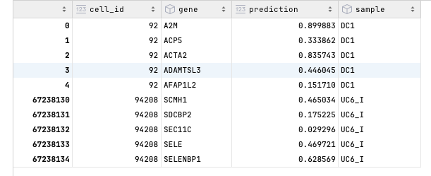

# Crunch 1 – Oct 28 to Jan 31 – Predict gene expression

## Evaluation Phases

In Crunch 1, you will have the opportunity to evaluate your model’s predictive performance on a validation dataset, before submission of your test dataset predictions.

There will be two validation checkpoints:

**Checkpoint 1** - November 30th (Eastern Time 17:59)

**Checkpoint 2** - December 30th (Eastern Time 17:59)

**Last submission -** January 31st (Eastern Time 17:59).

## Overview

In **Crunch 1**, you will train an algorithm to predict **spatial transcriptomics data** (gene expression in each cell) from matched **H\&E images**. In other words predict the gene expression (Y) in cells from specific tissue patches based on the **H\&E images** (X) and surrounding **spatial transcriptomics** data.

* **X (Input)**:&#x20;
  * **`HE_original`**: The **original H\&E image** in its native pixel coordinates. Alignment from H\&E native coordinate system to Xenium coordinate system has been handled from our end. If you prefer to handle alignment yourself, you can check **HE\_original** and **DAPI** (provided in crunch1\_max), but it may require additional processing.
  * **`HE_nuc_original`**: The **nucleus segmentation mask of H\&E image**, in H\&E native coordinate system. The cell\_id in this segmentation mask matches with the nuclei by gene matrix stored in **anucleus**.

<figure><figcaption></figcaption></figure>

* **Y**:
  * **`anucleus`**: This file contains the **aggregated gene expression data** for each nucleus. It is log1p-normalized and stores the gene expression profiles for 460 genes per nucleus. This is the primary target (**Y**) for your model.

<figure><figcaption>
Anucleus – gene expression for each nucleus
</figcaption></figure>

## Linking the H\&E image to spatial transcriptomics

Steps to align X and Y:

* **Step 1: Identify nuclei in the H\&E image**
  * Use the **nucleus segmentation masks**:
    * **H\&E nucleus segmentation (`HE_nuc_original`)**: This mask identifies the location of nuclei in the **original H\&E image** **(**i.e. **HE\_original)**.
* **Step 2: Link gene expression to H\&E images**
  * For each nucleus in the **H\&E image**, use the **`anucleus`** file to get the corresponding gene expression profile (Y) for that nucleus.
  * The **`anucleus`** file provides the gene expression data, where each row corresponds to a nucleus (cell) and each column corresponds to a gene.
  * The nuclei IDs from the segmentation masks (e.g., from **`HE_nuc_original`**) will match the IDs used in the **`anucleus`** file.

<figure><figcaption>
Matched  crop H&#x26;E image and its corresponding Gene Expression Heatmap
</figcaption></figure>


If you open the image HE\_nuc\_original,&#x20;

e.g. through `mask=sdata['HE_nuc_original'][0].to_numpy()`.

You can directly find the location of that cell, with cell\_id, through mask==cell\_id.


The datasets are store in a **SpatialData object.** Learn more about this format [here](https://spatialdata.scverse.org/en/stable/generated/spatialdata.SpatialData.html).

<pre><code>// SpatialData object structure

 Images
 // 
      ‘DAPI’: DAPI image (validation and test tissue patches are removed)
      ‘DAPI_nuc’: DAPI nucleus segmentation
      ‘HE_nuc_original’: H&#x26;E nucleus segmentation on original image
      ‘HE_nuc_registered’: H&#x26;E nucleus segmentation on registered image (registered to DAPI image)
      ‘HE_original’: H&#x26;E original image
      ‘HE_registered’: H&#x26;E registered image
      ‘group’: Defining train(0)/validation(1)/test(2), No_transcript-train(4) tissue patches
      ‘group_HEspace’: Defining train(0)/validation(1)/test(2), No_transcript-train(4)
tissue patches on the H&#x26;E image
<strong> 
</strong><strong> Points
</strong>      ‘transcripts’: DataFrame for each transcript (containing x,y,tissue patch,z_location,
    feature_name,transcript_id,qv,cell_id columns)
 
 Tables
       ‘anucleus’:  AnnData contains .X, .layers[‘counts’], .obsm[‘spatial’]
       ‘cell_id-group’: AnnData only contains .obs DataFrame for mapping of cell_id
        to region.

with coordinate systems:
     ‘global’, with elements:
        DAPI (Images), DAPI_nuc (Images), HE_nuc_original (Images), HE_nuc_registered
            (Images), HE_original (Images), HE_registered (Images), group (Images),
6 group_HEspace (Images), transcripts (Points)
   ‘scale_um_to_px’, with elements:
      transcripts (Points)
</code></pre>

In the minimum version of the data provided for crunch1 (in crunch1\_min.tar), only **HE\_original**, **HE\_nuc\_original**, **anucleus** and **cell\_id-group** are provided.

## Expected Output

The output consists of four columns:

* **cell\_id**: contains the held-out nuclei (both validation and test tissue regions).
* **gene**: the gene among the 460 genes to be predicted.
* **prediction**: the gene expression value, rounded to two decimal places.
* **sample**: the tissue sample among the 8 samples to process.


Make sure your predictions are log1p-normalized as in anucleus.X.


<figure><figcaption></figcaption></figure>

## Submit

To build a valid submission, your model need to be coded within the infer function, effectively respecting the crunch code submission interface.


See how to submit through the [quickstarter](https://github.com/crunchdao/quickstarters/blob/master/competitions/broad-1/quickstarters/random-submission/random-submission.ipynb)



Learn about crunch code [interface](../../code-interface.md)


