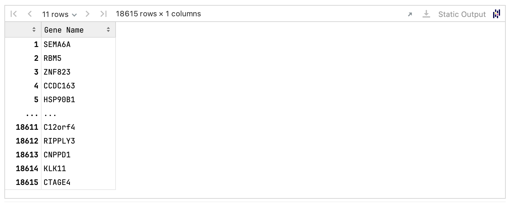

# Crunch 3 – Dec 9 to Jan 31 – Identifying Gene

## Overview

In **Crunch 3**, your task is to design a gene panel that best distinguishes **dysplasia regions** from **noncancerous mucosa regions** in colon tissue affected by Inflammatory Bowel Disease (IBD). Using provided H\&E images annotated by pathologists and single-cell RNA sequencing (scRNA-Seq) data, you will rank **18,615 protein-coding genes** based on their ability to discriminate between these disease states.

If you participated in **Crunch 1** or **Crunch 2**, you may leverage your previously developed models to make gene expression predictions on the annotated regions and design your gene panel based on these predictions. If not, you can design your gene panel from scratch using biological insights or other approaches.

Additionally, you are required to:

* Provide a **justification** for how you constructed your gene panel.
* [#peer-review](crunch-3.md#peer-review "mention") three submissions from other participants based on their justifications.

### X (Inputs Data)

#### H\&E Images and Annotations

* **First H\&E Image**: Includes only noncancerous mucosa (already provided in Crunch 1 and Crunch 2).
* **Second H\&E Image**: Entire colon tissue section including both dysplasia and noncancerous mucosa regions (`UC9_I-crunch3-HE.tif`).
* **Associated Files**:
  * **Nucleus Segmentation Masks**.
  * **Tissue Region Masks with Annotations** (`UC9_I-crunch3-HE-dysplasia-ROI.tif`):
    * **0**: Other tissue regions.
    * **1**: Noncancerous mucosa.
    * **2**: Dysplasia.

#### Single-cell RNA-Seq Data

* **Dataset**: `Crunch3_scRNAseq.h5ad`.
* **Content**: Gene expression data for 18,615 protein-coding genes from colon tissue samples with and without dysplasia.
* **Cell Metadata** (`adata.obs`):
  * **Cell Type**: `adata.obs["annotation"]`.
  * **Individual**: `adata.obs["individual"]`.
  * **Disease Status**: `adata.obs["status"]` (Normal, Unaffected tissue, Polyp, Adenocarcinoma).
  * **Dysplasia Status**: `adata.obs["dysplasia"]` (`y`, `n`, or `ND`).

#### Expression Data

* **Normalized Counts**: `adata.X` (log1p-normalized).
* **Raw Counts**: Available in `adata.layers["counts"]`

### Y (Targets)

#### Gene Ranking

Rank all 18,615 protein-coding genes from **1** (best discriminator) to **18,615** (worst), based on their ability to distinguish between dysplasia and noncancerous mucosa regions.

<figure><figcaption></figcaption></figure>


Including genes associated with different biological functions can enhance your gene panel and will be considered in the [#evaluation](crunch-3.md#evaluation "mention")


## Expected Output

Your submission should include the following.

### Gene Ranking DataFrame

* **Format**: A DataFrame returned by your `infer` function.
* **Structure**:
  * **Index (Rank)**: Unique integers from **1** (best discriminator) to **18,615** (worst).
  * **Column (Gene Name)**:  Gene symbols matching those provided in the dataset.

### Justification Report

* **File**: `REPORT.md`
* **Length**: Maximum **1 page**.
* **Content**:
  * **Method Description**: Explain how your method works. (5-10 sentences)
  * **Rationale**: Describe the reasoning behind your gene panel design. (5-10 sentences)
  * **Data and Resources Used**: Specify the datasets and any other resources utilized. (5-10 sentences)
* **References**: May be included (not counted toward the page limit).
* **Hard Requirement**: A submission will be rejected outright if the file is missing:
  * If you are submitting via the CLI, just create a `REPORT.md` at the root of your submission.
  * If you are submitting via a Notebook, you must write it in a Markdown Cell.\
    [Learn more about Embed Files.](../../participate.md#embed-files)
  * Only non-empty and non-comment lines are considered.\
    This is an example of what is expected:

```markdown
# Method Description

<!-- Explain how your method works. (5-10 sentences) -->
Lorem ipsum dolor sit amet, consectetur adipiscing elit.
Aliquam eget augue quis metus viverra vehicula sit amet lacinia odio.

# Rationale

<!-- Describe the reasoning behind your gene panel design. (5-10 sentences) -->
Praesent dignissim ipsum vel leo eleifend, eget pulvinar mauris ornare.
Duis efficitur lectus posuere iaculis dictum.

# Data and Resources Used

<!-- Specify the datasets and any other resources utilized. (5-10 sentences) -->
Donec feugiat eros vel odio gravida venenatis.
Nam et sem sit amet nisi vestibulum semper bibendum et libero.
```


The report is attached to the submission.\
To modify the `REPORT.md`, you must resubmit with the modified content.


## Peer Review

* **Mandatory Participation**: To qualify for prizes, you must review **three submissions** from other participants.
* **Purpose**: The peer review process is crucial for selecting the most promising gene panels for [#experimental-validation](crunch-3.md#experimental-validation "mention"). Your evaluations help identify submissions with strong justifications and innovative approaches, contributing to the advancement of dysplasia research.
* **Evaluation Criteria**:
  * Assign a score on a 1-3 scale
    * **1** - excellent justification
    * **2** - adequate justification
    * **3 -** poor justification
  * Provide a short explanation (200-400 words) covering:
    * Rationale of design.
    * Novelty of design.
    * Compliance with the required format.

## Evaluation

We will assess your submissions based on two key criteria:

* **Classification Accuracy**: We'll use your top 50 genes to train a model that distinguishes between dysplasia and noncancerous mucosa. The better your genes help the model correctly identify these regions, the higher your accuracy score will be. This is the main factor in determining your ranking.
* **Diversity**: We'll also consider the variety of biological functions represented in your gene panel. Including genes from different pathways enhances the panel's usefulness and may provide deeper insights into dysplasia. A more diverse panel is favorable and can help differentiate teams with similar accuracy.

Your final ranking will prioritize classification accuracy, with diversity as a supplementary factor to distinguish between submissions with close accuracy scores.

## Experimental Validation

To validate the most promising gene panels, **we will select up to 500 genes for experimental evaluation**. This selection will occur via two routes:

* **Route 1:** the top performers from Crunch 2 who also participate in Crunch 3 will have up to 50 of their highest-ranked genes included.
* **Route 2**: the top performers from Crunch 3, determined by peer review and expert evaluations, will also have up to 50 of their top genes included.

We will **order a Xenium gene** **panel** comprising these selected genes, reserving a small number of additional genes to identify important cell types in the colon. This panel will be used to perform spatial transcriptomics measurements on a new colon tissue section diagnosed with dysplasia, enabling **experimental validation of your gene panels.**
