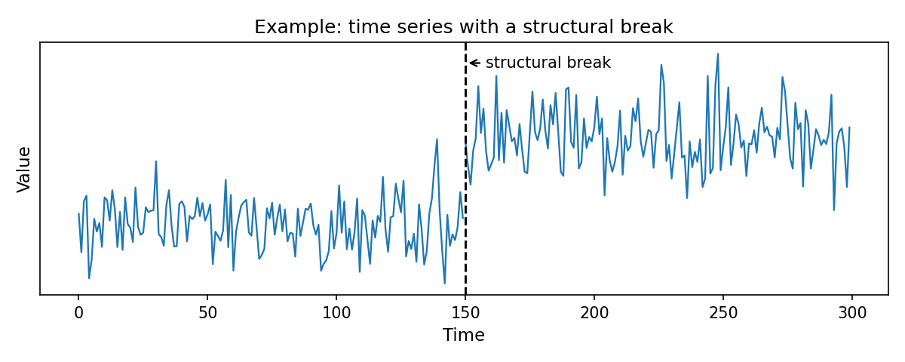
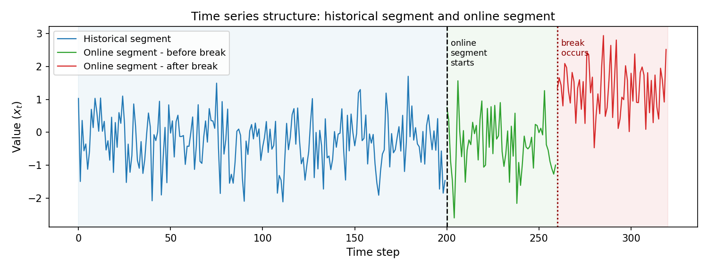
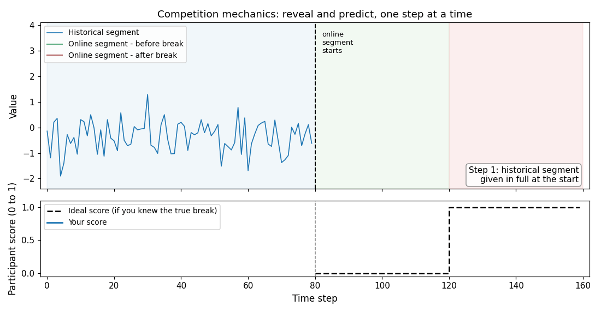
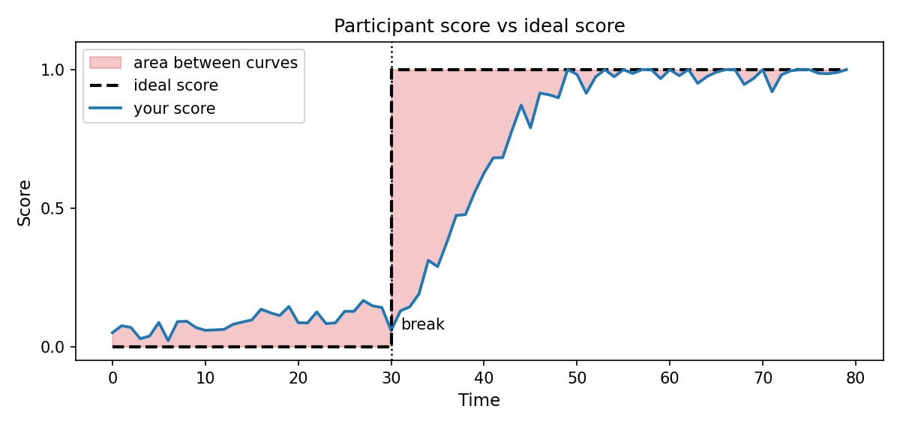

# ADIA Lab Structural Break Challenge: Real Time Edition

## Overview

Detecting structural changes in time series data in real time is a critical task across various scientific and engineering domains. In this competition, you monitor a stream of univariate time series data one observation at a time and, after each new observation, report how confident you are that a structural break has **already occurred** somewhere in the online segment up to and including the current step.

## Problem Statement

The task of this competition is to **monitor a univariate time series in real time** and, at each new observation, quantify whether a permanent structural break has already occurred somewhere up to that point.

Each series is comprised of a long historical segment (1,000 to 5,000 observations, with no break), and an online segment (10 to 1,000 observations, possibly with a structural break).

The observations in this online segment are revealed one at a time: after each of them, your detection algorithm must output a score between `0` and `1`, reflecting cumulative confidence that a structural break has already occurred - `0` if absolutely confident no break has occurred, `1` if absolutely confident a break has already occurred.

The training data (with known structural break locations) combines a large collection of synthetic and real-world time series exhibiting a wide variety of break types - including changes in mean, variance, distributional shape, and dependence structure.

Submissions are evaluated on an independent test set using the Time-Stratified AUC (`TS-AUC`): at each online time step, a standard AUC is computed cross-sectionally across all series, and the weighted average over time steps is the final score.

### Differences from the 2025 Edition

If you participated in the 2025 edition, the core concept is the same, but the mechanics are fundamentally different:

<table><thead><tr><th width="139.415283203125"></th><th width="300.6795654296875">2025</th><th>2026 (this one)</th></tr></thead><tbody><tr><td>Data delivery</td><td>Both segments given at once</td><td>Online segment arrives <strong>one step at a time</strong></td></tr><tr><td>Break location</td><td>Always at the known boundary</td><td><strong>Unknown</strong> -- anywhere in the online segment</td></tr><tr><td>Output</td><td>One score per series</td><td><strong>One score per time step</strong></td></tr></tbody></table>

This edition mirrors a realistic monitoring scenario: you watch a stream of data and, after each new observation, you report how confident you are that the process has already changed.

## Competition Timeline

* Start Date: May 6th, 2026 at 4:00 p.m. UTC
* Quota Refresh: every Wednesday at 4:00 p.m. UTC
* End Date: September 17th, 2026 at 4:00 p.m. UTC (Thursday)[^1]
* Final Evaluation: End of October, 2026
* Winners Announcement: [During the ADIA Lab 2026 Symposium](https://www.adialab.ae/upcoming-events/adia-lab-symposium-2026) (26–28 October)

## What is a Structural Break?

A **structural break** occurs when the statistical behaviour of a time series changes permanently at some point in time. Before the break, the data follows one process; from the break onwards, it follows a different one.

The figure below shows a simple example: the series has a constant mean before the break and a different mean after it. The dashed line marks the break time.

<figure><figcaption><p>Example: a time series with a structural break.</p></figcaption></figure>

Structural breaks appear in many domains:

* **Climatology:** shifts in weather patterns that may signal climate anomalies or long-term change.
* **Industry:** changes in machinery sensor readings that anticipate equipment failures or maintenance needs.
* **Healthcare:** sudden changes in physiological signals that may indicate critical health events.
* **Finance:** shifts in market or strategy behaviour relevant to risk management and portfolio decisions.

## Dataset

The dataset contains a large and diverse collection of univariate time series exhibiting many different kinds of structural breaks -- changes in mean, variance, distribution shape, correlation structure, and more. All series are pre-processed into a common z-scored format.

Each series is split into two parts, a **historical segment** and an **online segment**.

<figure><figcaption><p>Time series structure</p></figcaption></figure>

### **Historical segment**

The **historical segment** is a long reference sequence provided to you in full at the start, typically between 1,000 and 5,000 observations. It represents the behaviour of the series before any potential break.

### Online segment

The **online segment** follows the historical segment and is revealed to you **one observation at a time,** typically between 10 and 1,000 observations long.

After you submit your score for the current observation, the next one is released. There is no way to look ahead.

Each series contains **at most one** structural break, and the historical segment is always break-free.

Any break, if present, falls somewhere within the online segment:

* With probability `0.5`, a break occurs at some unknown point within the online segment. You must infer its position from the data.
* With probability `0.5`, no break occurs during the online segment at all.

### Break position

For the training set only, the **break position** `tau` is a 0-indexed position within the online segment at which the break occurs, or `None` if no break occurs.

### Data Size

The dataset is divided into multiple parts:

| Split                         | Availability  | Number of series |
| ----------------------------- | ------------- | ---------------- |
| Public training set           | Local & Cloud | 10,000           |
| Public **(reduced)** test set | Local         | 100              |
| Public test set               | Cloud         | 10,000           |
| Private test set              | Cloud         | 10,000           |

[True values](#user-content-fn-2)[^2] are only available for the training set (both locally and in the cloud) and the reduced test set (only locally).

## Scoring

The competition uses a single metric: **Time-Stratified** [**AUC**](https://scikit-learn.org/stable/modules/generated/sklearn.metrics.roc_auc_score.html) **(TS-AUC)**.

At each online time step $$t$$, the metric computes a standard AUC cross-sectionally across all series alive at that step:

* A series is **positive** at step $$t$$, if the break has already occurred by that step (ideal score = `1`).
* A series is **negative** at step $$t$$, otherwise (ideal score = `0`).

The TS-AUC is the weighted average of these per-step AUCs, with weight $$w(t) = n_\text{pos}(t) \cdot n_\text{neg}(t)$$ (the number of positive-negative pairs at step $$t$$):

$$
\text{TS-AUC} = \frac{\sum_t w(t)\,\text{AUC}(t)}{\sum_t w(t)}
$$

* `0.5`: equivalent to random guessing.\
  To score above 0.5, a predictor must use the content of the series: at every fixed $$t$$, the metric compares series against each other, so a score that does not depend on the series cannot discriminate.
* `1.0`: perfect detection.

## Code Submission

This is a code competition where participants are required to submit their Python code (files or notebooks) directly to the Crunch Hub.

Your submission should:

1. Process and analyze the data;
2. Output a score between `0` and `1` for each time series steps in the test set, representing the likelihood of a structural break;
3. Your code must produce deterministic output, or it will be ineligible for any rewards;
4. If you participate as a team, only [the team leader](../teams/#leaders) will be ranked on the leaderboard, [rewards are split among all members](../teams/rewards.md).

Your submitted code will be executed on the platform and automatically scored against a portion of the test set. Shortly after submission, your score will appear on the public leaderboard of the competition.

<figure><figcaption><p>Visual animation.</p></figcaption></figure>

### Interface

At each new online observation, produce a **score between `0` and `1`** representing your cumulative confidence that a structural break has **already occurred** somewhere in the online segment up to and including the current step:

* **`0`**: no break detected so far.
* **`1`**: a break has definitely already occurred.

You produce one score per time step, so for a series with an online segment of length `T` you output `T` scores.

<pre class="language-python" data-title="Python Notebook Cell" data-expandable="true"><code class="lang-python">def infer(
    datasets: Iterable[Tuple[List[float], Iterable[float]]],
    model_directory_path: str,
):
    """
    Load your trained model, then use the `yield` keyword to indicate that it is ready.
    Then iterate over the datasets and points to provide a result using `yield &#x3C;prediction>`.

    Args:
        datasets: the data object to iterate.
        model_directory_path: the path to the directory where you model has been saved in the train function.
    """

    model = joblib.load(os.path.join(model_directory_path, 'model.joblib'))

<strong>    # Mark as ready
</strong><strong>    yield
</strong>
<strong>    for x_historical, x_online in datasets:
</strong><strong>        for point in x_online:
</strong>
            # Consume the point (float)
            result = model.consume(point)

<strong>            # Provide your result, one at a time
</strong><strong>            yield result
</strong></code></pre>

There are a few constraints on the data that will stop your code if you try to ignore them:

* You must provide your result before you can get the next point from `x_online`.
* The online segment cannot be read twice.
* You must `yield` at each point.


Rely on the testing tool to make sure your code is working as intended locally.


### Requirements

Your solution must include two functions:

* `train()`: to train your model on the training set.\
  [You must provide it if your model requires training](../faqs/#can-i-train-a-model-locally). If not, you can leave it empty.
* `infer()`: to returns predictions on the test set.

The execution time of your solution should not exceed the platform's time limits: **15 hours per week**.

Your solution must be deterministic: when [**re-run on 30% of the data**](#user-content-fn-3)[^3], the predicted values should be the same (within a **tolerance of 1e-8**).

#### What a good score sequence looks like

The ideal score is a step function: it stays at `0` as long as no break has occurred, then jumps to `1` as soon as the break happens. If there is no break, the ideal score is `0` throughout.

The figure below shows how your detection algorithm's score sequence (solid line) compares to the ideal sequence (dashed step). The shaded area between them reflects how early and how cleanly the break was detected.

<figure><figcaption><p>Evaluation example</p></figcaption></figure>

### Computational note

With 10,000 series and up to 1,000 online steps each, solutions that recompute everything from scratch at every step may run into time budget constraints.

Incremental approaches, which are maintaining a compact running state and updating it with each new observation, are worth considering for efficiency, though any solution that fits within the time budget is acceptable.

### Parallelism


This feature is still in the beta stage, so its behavior may change. We are collecting feedback to ensure that it can be used safely by everyone.


Infering so many points can be slow. That is why we offer a parallel approach, but **only at the time series level**. Your model **must still process each point separately**.

Depending on your model's capacity, the dataset will be split into n equal parts. Your model will start n times **in different processes** [(not threads)](#user-content-fn-4)[^4], and each process will receive and fully process one part.

#### How to use it

To ensure optimal performance, your model must follow a few restrictions:

* Because of the concurrency, your model should avoid writing any files.
* Make sure the cloud environment can handle the RAM and CPU consumption of your model.
  * If you want 6 processes and your model consumes 4 GB of RAM, the runtime must have 4 \* 6 = 12 GB of RAM plus some overhead.
  * The same applies to CPU cores. Overallocation can actually decrease performance.

You can enable parallel processing by simply specifying the number of workers you want via a global constant:


```python
# @crunch/keep:on
INFER_PARALLELISM = 4
```



The [`@crunch/keep:on` command](https://docs.crunchdao.com/competitions/participate/notebook-processor#automatic-line-commenting) is only required for notebook users to prevent the line from being commented out. Keep the constant in a dedicated cell, or add `@crunch/keep:off` after the assignation.


## Methodology Suggestions

* **Statistical tests** comparing the distribution of the historical segment to the online observations seen so far (t-tests, KS tests, CUSUM).
* **Change-point detection algorithms** designed for online or streaming data.
* **Feature extraction** summarising the online window incrementally, fed into a trained classifier.
* **Probabilistic and Bayesian models** tracking the likelihood of a change sequentially.
* **Deep learning** models trained to score (series, time step) pairs using the labeled training data.
* **Foundation models for time series** pre-trained on large corpora, used as feature extractors or fine-tuned on the labeled training data.

Whatever approach you choose, the training set provides full supervision: the known break positions let you construct labeled (series, time step) pairs and apply standard binary classification training.

## Prizes

| Winners’ rank | Prize value |
| ------------- | ----------- |
| 1st place     | $40,000 USD |
| 2nd place     | $20,000 USD |
| 3rd place     | $10,000 USD |
| 4th place     | $5,000 USD  |
| 5th place     | $5,000 USD  |
| 6th place     | $5,000 USD  |
| 7th place     | $5,000 USD  |
| 8th place     | $3,500 USD  |
| 9th place     | $3,500 USD  |
| 10th place    | $3,000 USD  |

[^1]: Sept. 16 will be the last quota refresh.

[^2]: Also known as Y train/test.

[^3]: Only applies to inference, not training.

[^4]: This means that memory is not shared. Your running model cannot communicate with other running models.
