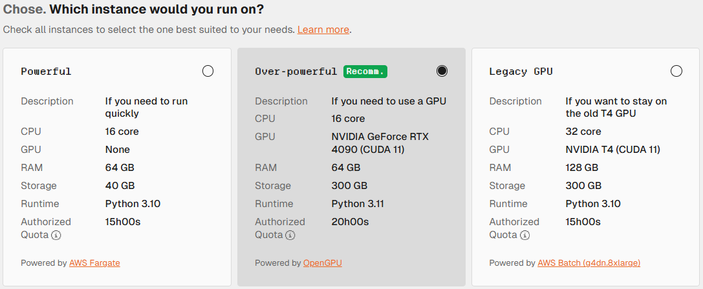

# Resources Limit

## Submissions

You can only submit during the [Submission Phase](../../other/glossary.md#submission-phase).

You can only submit up to 5 times per day. Some competition may allow more. You can see your current submission for the day at the bottom left.

A submission cannot exceed 5GB and his `resources/` directory cannot exceed 10GB.


We can **exceptionally** allow you more as we understand that debugging why your code works locally but not in the cloud environment can be very difficult.

For this, [please contact us on Discord](../faqs/contact-us.md#help-with-the-hub-competition).


## Models

Also known as the `resources/` directory, it allows you to carry state information over multiple runs, provided the total size is under 10 GB.

There is no limit on the number of files themselves, but if we detect abuse, we may introduce one that could break existing models.

All types of file are permitted, including but not limited to:

* persisted models (.joblib),
* model weights (.pkl),
* configuration files,
* ...

Compared to including them in your submission, those files can be modified and persisted across multiple runs.

## Runs

For a run to be considered valid, it must:

* not crash due to a bug in your code or because you have run out of RAM/disk space,
* complete the work under the time constraints,
* produce a prediction.

Predictions are checked once the run is over. However, if a prediction is deemed invalid, the run itself will not be invalidated.

### **Resources**

You can view the runtime specifications before creating a run:

<figure><figcaption>
Runtime option selector on the Run creation page.
</figcaption></figure>


The "Authorized Quota" is global; it is not allocated to each individual runtime.

Some consume the quota faster, some slower, but almost always at the normal speed. This rate is based on how much they cost and how powerful they are.


#### Providers

We have used AWS's managed [Fargate](https://aws.amazon.com/fargate/) and [Batch](https://aws.amazon.com/batch/) ([using `g4dn.8xlarge` instances](https://aws.amazon.com/ec2/instance-types/g4/)) services for a long time, but we recently introduced a new provider: [OpenGPU](https://opengpu.network/), which provides faster and more powerful GPUs for when you require extra processing power.

Using one provider instead of another should not affect your code. If you think there is a bug, please [contact us on Discord](../faqs/contact-us.md#help-with-the-hub-competition).

#### Networking

Access to the internet in a cloud environment is not permitted, but is handled differently depending on the type of runtime:

* For CPU: no [socket](https://en.wikipedia.org/wiki/Network_socket)-related [operations](https://man7.org/linux/man-pages/man2/socketcall.2.html) are not permitted.
* For GPU: a local network is available, but is not configured to access the internet.

This difference in behaviour is due to the fact that GPUs rely on sockets for communication. The same applies to multiprocessing libraries: you need to choose a runtime with a GPU to make them work, even if you don't need the GPU itself.

### Quota

The allocated quota are different per competition, you should the overview section to know how much is granted to every participants.

You can also visualize your quota usage under the **Submissions & Runs** tab.

Failed runs are not taken into account when computing the quota. This is to prevent situations where you accidentally use up your entire quota in one go and have to wait until next week to try again.

#### Resets

The quota resets every week during the [Submission Phase](../../other/glossary.md#submission-phase).

It only resets once at the beginning of the [Out-of-Sample Phase](../../other/glossary.md#out-of-sample-phase). Most competitions are unaffected by this, as they run the models on the entire dataset at once. However, some competitions run models on small sections of the dataset over several weeks.

### Security

Your model runs with the lowest possible level of privilege.

Most of the time, the data is fed directly to your function as an argument, as some pre-processing operations (such as filtering) are sometimes needed.

Any users attempting to bypass the restriction mechanism will be **disqualified**!

## Predictions

Your prediction must not exceed a certain size. This limit varies depending on the competition, but is usually large enough to accommodate everyone.

However, when participants are responsible for writing the prediction files themselves, they must also ensure that they name their files properly and use the correct flags to persist them in the correct format. The most common mistake is including the default pandas.DataFrame index when [saving a CSV file](https://pandas.pydata.org/docs/reference/api/pandas.DataFrame.to_csv.html).

Participants cannot download prediction files. If a check fails, the error message should include enough details to help you debug the situation (extra or missing columns, `NaN` or infinite values, ...). If you need further assistance, please, [contact us on Discord](../faqs/contact-us.md#help-with-the-hub-competition).
