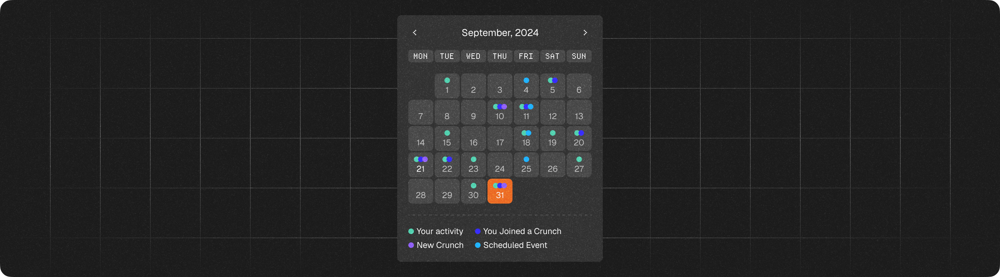

# Navigate the Dashboard

## Dashboard

A single place to consolidates the latest news, crunches, and your model's performance to provide a quick overview of current activity.

### The Event Calendar

To stay informed about upcoming events, CrunchDAO maintains a calendar widget that displays:

* Your activities
* Upcoming crunches
* Times when you joined a crunch
* Upcoming events (webinars, physical meetings, conferences, etc.).

<figure><figcaption>
The calendar widget
</figcaption></figure>

### The Contribution Graph

Similar to GitHub, it tracks your activity within the CrunchDAO ecosystem.

The deeper the colors, the more invested you are!

<figure><figcaption>
The contributions widget
</figcaption></figure>


[Understand how activities are counted](activity-graphs.md)


### The Rewards Graph

Track how much CrunchDAO gave to the community via leaderboard prizes.

To ensure full transparency regarding the rewards given to the community, all transactions are made on the blockchain and are accessible via the [payouts page](https://hub.crunchdao.com/account/payouts).

<figure><figcaption>
The rewards widget
</figcaption></figure>

### The Competition Summary Card

Take a quick look at how your models are performing in the crunches you have joined that are currently active.

<figure><figcaption></figcaption></figure>

## Currently Ongoing Crunches

You can find a directory of available crunches. We encourage users to explore a variety of crunches to expand their knowledge.

If you are curious, you can also consult previous crunches that have already ended.

<figure><figcaption>
Currently open crunches
</figcaption></figure>

