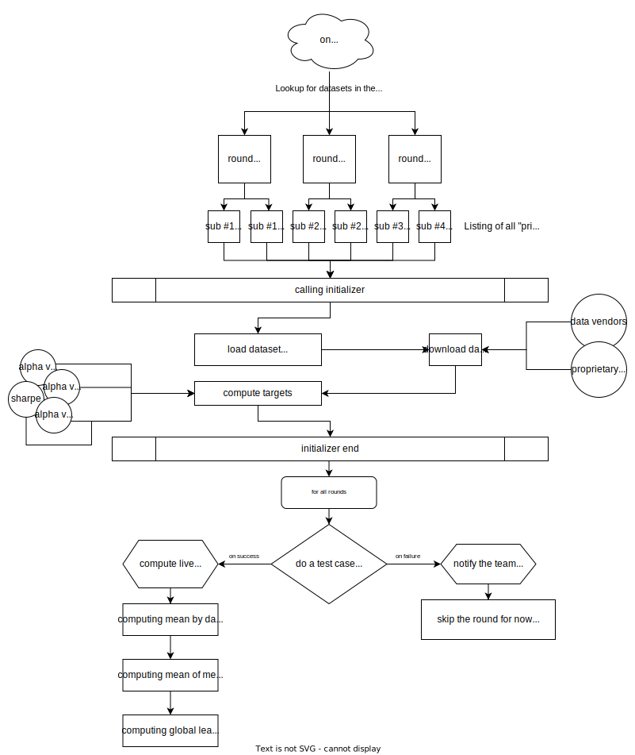

# Live Score Computation Process

Computing the live score each weeks is a very computationally intensive process.

Targets computer have to be made to make sure everything works as expected.

Here is a schema on how the process is working internally:

### Active datasets lookup

.png>)

This board allows you to control which dataset is currently active and score with live data.

### Listing of `primary` submissions

Primaries submissions are the ones that you submitted and selected for live scoring.

### Live Score computation

For each primary submission, the scorer will compute the spearman correlation score between your prediction for that target (30, 60, 90 days) and what happened live.

### Mean by dataset

For each dataset your live score for this dataset is the mean of your last two participation at this dataset.

### Mean of mean

Global mean score is the mean of all your live scores over the universe of strategy. If you miss a round you get a score of zero.

### Normalization

Since December, all round' scores are normalized to avoid some rounds to be more weighted in the overall score: [https://discord.com/channels/770586873260933120/770586873260933124/905097810502910033](https://discord.com/channels/770586873260933120/770586873260933124/905097810502910033)

### Computing global leaderboard

Crunchers are ranked by their mean live spearman correlation score normalized over all strategies.
